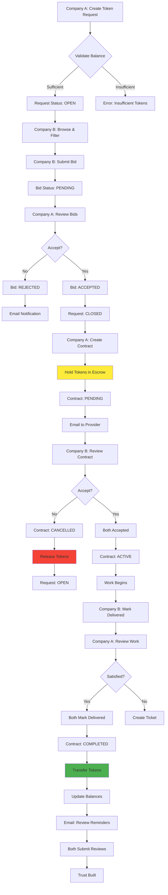
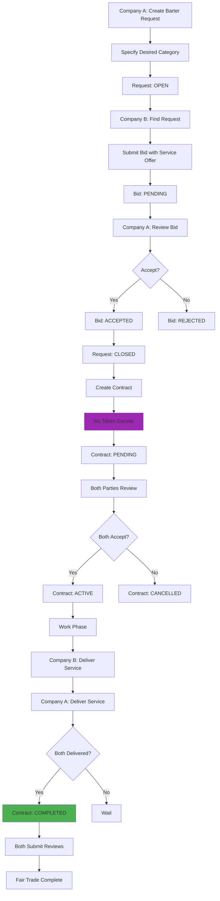
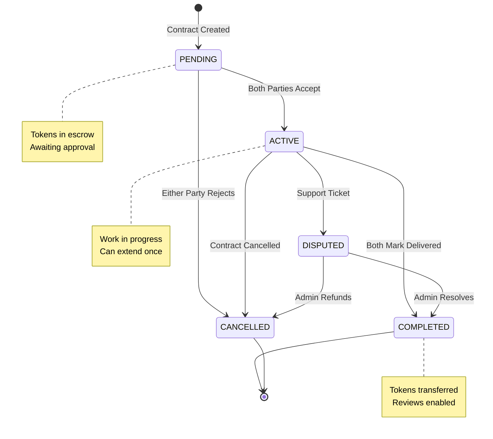
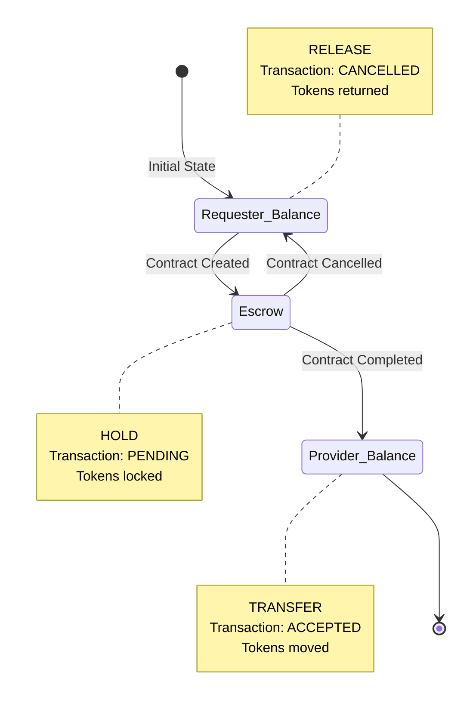

# 🤝 Manfaa – B2B Service Exchange Platform  

## Overview  
**Manfaa** is a backend system that aggregates B2B service exchange opportunities in Saudi Arabia.  
It enables companies to easily find and offer professional services through two exchange mechanisms, while managing the complete lifecycle from request to delivery.  

Companies gain access to **Token-based payments or Barter exchanges** with secure escrow and bilateral contract approval.  

---

## Features  

### Company  
- Sign up / Login.  
- Create company profile (name, industry, team size, description).  
- Manage skills portfolio (assign/remove from available skills).  
- **Service Requests**:
  - Create requests (Token/Barter/Either exchange type).
  - Specify deliverables, timeline, and budget.
  - Update or delete OPEN requests.
  - Browse and filter by category, exchange type, token range, date range.
  - Sort by token amount (ascending/descending).
- **Bidding**:
  - Submit competitive bids with pricing and timeline.
  - Update or delete PENDING bids.
  - Accept or reject received bids (as requester).
  - Receive email notifications on bid decisions.
- **Contracts**:
  - Create contracts from accepted bids.
  - Bilateral approval required (both parties must accept).
  - Track status (PENDING → ACTIVE → COMPLETED).
  - Mark delivery complete with proof.
  - Extend contract time once (50% of original duration).
  - Cancel or reject contracts.
  - **Token Escrow**: Secure payment held until completion.
- **Credits**:
  - View token balance, total earned, total spent.
  - View transaction history.
  - Purchase tokens via payment gateway.
- **Reviews**:
  - Rate completed contracts (1-5 stars, decimals allowed).
  - Write review descriptions (min 10 characters).
  - View received and written reviews.
  - Update or delete own reviews.
  - Search reviews by keyword.
  - Filter by exchange type.
  - Sort by rating (best to worst).
- **Subscriptions**:
  - Subscribe monthly (120 SAR) or yearly (1,200 SAR).
  - Benefits: Priority search, higher support priority, premium badge.
  - Cancel anytime (active until period end).
- **Support Tickets**:
  - Create tickets (CONTRACT/SUBSCRIPTION/PLATFORM/SUGGESTION).
  - Auto-priority based on category and subscriber status.
  - Update or delete OPEN tickets.
  - Track resolution status.
- Email notifications for bids, contracts, reviews, refunds, and tickets.

### Admin  
- View all users.  
- Add new admins.  
- Update or delete users.  
- Delete company profiles.  
- **Categories** (10 categories):
  - Web Development, Mobile Development, Digital Marketing.
  - Graphic Design, Content Writing, Video Production.
  - Data Analysis, IT Consulting, Cloud Services, Cybersecurity.
  - Add, update, delete categories.
- **Skills** (10+ skills):
  - React.js, Node.js, Python, Java, Flutter.
  - AWS, Docker, PostgreSQL, MongoDB, Machine Learning.
  - Add, update, delete skills.
  - Search skills by keyword.
- **Monitoring**:
  - View all reviews, tickets, transactions, subscriptions.
  - Resolve tickets.
  - View all company credits.
- **Operations**:
  - Process credit refunds.
  - Add credits to companies.
  - Handle contract rejections and refunds.

---

## Tech Stack  
- **Backend:** Spring Boot 3, Spring Security, Hibernate/JPA  
- **Database:** MySQL  
- **Email Service:** JavaMailSender (SMTP)  
- **Payment Gateway:** Integration ready (Moyasar/Stripe compatible)  
- **Authentication:** JWT (JSON Web Tokens) with HTTP-only cookies  
- **Password Encryption:** BCrypt  
- **Authorization:** Role-based (`COMPANY`, `ADMIN`)  
- **Build Tool:** Maven  

---

## Roles & Example Endpoints  

### Public  
- `POST /api/v1/company/register` → Register a company.  
- `POST /api/v1/auth/login` → User login.  

### Company  
- `GET /api/v1/service-request/get-all` → Get all service requests.  
- `POST /api/v1/service-request/token/{companyId}` → Create token-based request.  
- `POST /api/v1/bid/create/{companyId}/{requestId}` → Submit a bid.  
- `POST /api/v1/bid/accept/{bidId}/{userId}` → Accept a bid.  
- `POST /api/v1/contract/create` → Create a contract.  
- `POST /api/v1/contract/complete/{contractId}` → Mark delivery complete.  
- `POST /api/v1/reviews/add/{reviewedCompanyId}/{contractId}` → Add review.  
- `POST /api/v1/subscription/monthly/{companyProfileId}` → Subscribe monthly.  

### Admin  
- `GET /api/v1/user/get-all` → Get all users.  
- `DELETE /api/v1/user/delete/{userId}` → Delete a user.  
- `POST /api/v1/category/add` → Add service category.  
- `POST /api/v1/skills/add` → Add skill to library.  
- `POST /api/v1/transaction/refund/{contractId}` → Process credit refund.  

---

## Diagrams

### System Flow Diagrams

#### Token-Based Service Exchange Flow

#### Barter Service Exchange Flow

#### Contract Lifecycle

#### Token Escrow System

---

### Links

- [🎨 Figma Design](https://www.figma.com/site/3bPA8IWIxBTUWX803YicFz/Manafaah?node-id=0-1&p=f&t=eFcKHpnWZnGD9ogl-0)

---

## Enhancements & Creative Improvements
- **Token Escrow System**: Secure three-state token lifecycle (HOLD → RELEASE/TRANSFER) ensures transaction integrity.  
- **Dual Exchange Types**: Flexible payment options (Tokens, Barter, or Either) for diverse B2B business needs.  
- **Bilateral Contract Approval**: Both requester and provider must approve contracts before activation.  
- **Email Automation**: Automated notifications at every step (bids, contracts, reviews, refunds).  
- **Advanced Review System**: Transparent feedback with search, filtering, and sorting capabilities.  
- **Subscription Model**: Monthly (120 SAR) and yearly (1,200 SAR) plans with priority features.  
- **Smart Ticket Prioritization**: Automatic priority assignment based on category and subscriber status.  

---

## Summary
Manfaa is designed to be a **full-featured backend solution** for B2B service exchange in Saudi Arabia.  
It balances **service requester convenience, provider opportunities, and admin control**, while integrating **secure token escrow, bilateral contract approval, and comprehensive dispute resolution**.  
With clear data modeling, automated email notifications, and robust review system, Manfaa provides a complete ecosystem for B2B service operations.  

---

# API Endpoints Summary

| Controller | Count |
|---|---:|
| AuthController | 2 |
| UserController | 4 |
| CompanyProfileController | 7 |
| CategoryController | 4 |
| SkillsController | 8 |
| CompanyCreditController | 1 |
| ServiceRequestController | 13 |
| ServiceBidController | 6 |
| ContractAgreementController | 6 |
| ReviewController | 14 |
| CreditTransactionController | 5 |
| SubscriptionController | 4 |
| TicketController | 4 |
| **Total** | **78** |

---

## AuthController (`/api/v1/auth`)
| Method | Path | Description | Name |
|---|---|---|---|
| POST | `/login` | User login (returns JWT token) | mohammed |
| POST | `/logout` | User logout (clears JWT cookie) | mohammed |

---

## CompanyProfileController (`/api/v1/company`)
| Method | Path | Description | Name |
|---|---|---|---|
| GET | `/get-all` | Get all company profiles | nawaf |
| POST | `/register` | Register new company | nawaf |
| PUT | `/update` | Update company profile | nawaf |
| DELETE | `/delete` | Delete company profile | nawaf |
| GET | `/get-companies-full` | Get all companies with full details | nawaf |
| GET | `/get-company-full` | Get current company full details | nawaf |
| GET | `/get-company-id-full/{companyId}` | Get company by ID with full details | nawaf |

---

## CategoryController (`/api/v1/category`)
| Method | Path | Description | Name |
|---|---|---|---|
| GET | `/get` | Get all categories | ibrshim |
| POST | `/add` | Add category (Admin) | ibrahim |
| PUT | `/update/{categoryId}` | Update category (Admin) | ibrahim |
| DELETE | `/delete/{categoryId}` | Delete category (Admin) | ibrahim |

---

## SkillsController (`/api/v1/skills`)
| Method | Path | Description | Name |
|---|---|---|---|
| GET | `/get-all` | Get all skills | ibrahim |
| POST | `/add` | Add skill (Admin) | ibrahim |
| PUT | `/update/{skillsId}` | Update skill (Admin) | ibrahim |
| DELETE | `/delete/{skillsId}` | Delete skill (Admin) | ibrahim |
| POST | `/assign/{userId}/{skillId}` | Assign skill to company | ibrahim |
| DELETE | `/remove/{userId}/{skillId}` | Remove skill from company | ibrahim |
| GET | `/company/{companyId}` | Get skills by company | ibrahim |
| GET | `/search/{keyword}` | Search skills by keyword | ibrahim |

---

## CompanyCreditController (`/api/v1/credit`)
| Method | Path | Description | Name |
|---|---|---|---|
| GET | `/get-all` | Get all company credits | mohammed |

---

## ServiceRequestController (`/api/v1/service-request`)
| Method | Path | Description | Name |
|---|---|---|---|
| GET | `/get-all` | Get all service requests | mohammed |
| POST | `/token/{companyId}` | Create token-based request | mohammed |
| POST | `/barter/{companyId}` | Create barter request | mohammed |
| POST | `/either/{companyId}` | Create either-type request | mohammed |
| PUT | `/update/{id}/{requestId}` | Update service request | mohammed |
| DELETE | `/delete/{requestId}/{id}` | Delete service request | mohammed |
| GET | `/category/{categoryId}` | Get requests by category | mohammed |
| GET | `/category/{categoryId}` | Get requests with bids | mohammed |
| GET | `/category/{categoryId}` | Get requests with bids subscriber | mohammed |
| GET | `/category/{categoryId}` | Get requests with bids subscriber | mohammed |
| GET | `/status/{status}` | Get requests by status | mohammed |
| GET | `/get-by-exchange-type/{exchange_type}` | Get requests by exchange type | mohammed |
| GET | `/date-range` | Filter by date range | mohammed |
| GET | `/token-range` | Filter by token range | mohammed |
| GET | `/sort/{order}` | Sort by token amount | mohammed |
| GET | `/get-company-open/{company_id}` | getOpenServiceRequestOfCompany | mohammed |
| GET | `/get-company-closed/{company_id}` | getClosedServiceRequestOfCompany | mohammed |
| GET | `/get-company-canceld/{company_id}` | getCanceldServiceRequestOfCompany | mohammed |

|

---getOpenServiceRequestOfCompany

## ServiceBidController (`/api/v1/bid`)
| Method | Path | Description | Name |
|---|---|---|---|
| GET | `/get-all` | Get all bids | mohammed |
| POST | `/create/{companyId}/{requestId}` | Submit bid | mohammed |
| PUT | `/update/{id}/{bidId}` | Update bid | mohammed |
| DELETE | `/delete/{id}/{bidId}` | Delete bid | mohammed |
| POST | `/accept/{bidId}/{userId}` | Accept bid | mohammed |
| POST | `/reject/{bidId}/{userId}` | Reject bid with notes | mohammed |

---

## ContractAgreementController (`/api/v1/contract`)
| Method | Path | Description | Name |
|---|---|---|---|
| GET | `/get-all` | Get all contracts | mohammed |
| POST | `/create` | Create contract | mohammed |
| DELETE | `/delete/{contractId}` | Delete pending contract | mohammed |
| POST | `/accept/{contractId}` | Approve contract | mohammed |
| POST | `/reject/{contractId}` | Reject contract | mohammed |
| POST | `/complete/{contractId}` | Mark delivery complete | mohammed |

---

## ReviewController (`/api/v1/reviews`)
| Method | Path | Description | Name |
|---|---|---|---|
| GET | `/get-all` | Get all reviews (Admin) | ibrahim |
| GET | `/get/{reviewId}` | Get review by ID | ibrahim |
| POST | `/add/{reviewedCompanyId}/{contractId}` | Add review | ibrahim |
| PUT | `/update/{reviewId}` | Update review | ibrahim |
| DELETE | `/delete/{reviewId}` | Delete review | ibrahim |
| GET | `/company/{companyId}/received` | Get reviews received | ibrahim |
| GET | `/company/{companyId}/written` | Get reviews written | ibrahim |
| GET | `/company/{companyId}/reviewed-contracts` | Get reviewed contracts | ibrahim |
| GET | `/search/{keyword}` | Search reviews by keyword | ibrahim |
| GET | `/exchange-type/{exchangeType}` | Filter reviews by exchange type | ibrahim |
| GET | `/company/{companyId}/best-to-worst` | Sort reviews by rating | ibrahim |
| POST | `/create-pending-reviews/{contractAgreementId}` | Create pending reviews | ibrahim |
| POST | `/handle-rejection/{contractAgreementId}` | Handle rejection & refund | ibrahim |

---

## CreditTransactionController (`/api/v1/transaction`)
| Method | Path | Description | Name |
|---|---|---|---|
| GET | `/get-all` | Get all transactions (Admin) | mohammed |
| GET | `/get-by-companyId/{companyId}` | Get company transactions (Admin) | mohammed |
| GET | `/get-my-transactions` | Get current company transactions | mohammed |
| POST | `/add-balance` | Add credit to company (Admin) | mohammed |
| POST | `/refund/{contractId}` | Process credit refund (Admin) | mohammed |

---

## SubscriptionController (`/api/v1/subscription`)
| Method | Path | Description | Name |
|---|---|---|---|
| GET | `/get-all` | Get all subscriptions (Admin) | ibrahim |
| POST | `/monthly/{companyProfileId}` | Subscribe monthly (120 SAR) | ibrahim |
| POST | `/yearly/{companyProfileId}` | Subscribe yearly (1,200 SAR) | ibrahim |
| DELETE | `/cancel/{companyId}/{subscriptionId}` | Cancel subscription | ibrahim |

---

## TicketController (`/api/v1/ticket`)
| Method | Path | Description | Name |
|---|---|---|---|
| GET | `/get-all/{adminId}` | Get all tickets (Admin) | mohammed |
| POST | `/create/{companyId}/{contractId}` | Create support ticket | mohammed |
| PUT | `/update/{ticketId}/{companyId}` | Update ticket | mohammed |
| DELETE | `/delete/{ticketId}/{companyId}` | Delete ticket | mohammed |

---
