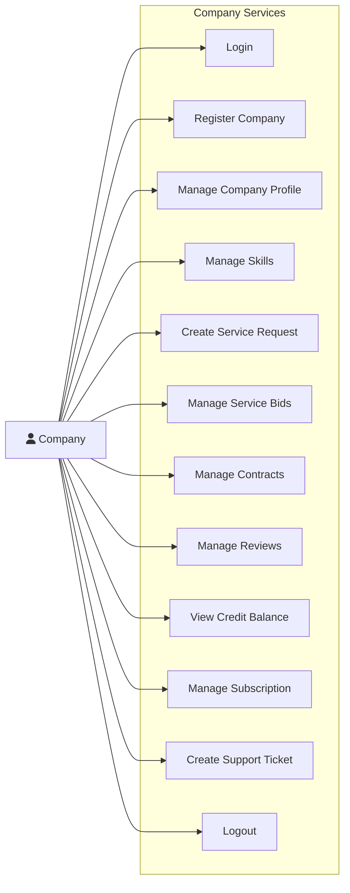

# Manfaa - B2B Service Marketplace Platform

<div align="center">


**A comprehensive B2B service marketplace enabling companies to exchange services through tokens or barter**

[Features](#features) • [Installation](#installation) • [API Documentation](#api-documentation) • [Contributing](#contributing)

</div>

---

## 📖 Table of Contents

- [About](#about)
- [Features](#features)
- [Tech Stack](#tech-stack)
- [System Architecture](#system-architecture)
- [Installation](#installation)
- [Configuration](#configuration)
- [API Documentation](#api-documentation)
- [Database Schema](#database-schema)
- [Use Cases](#use-cases)
- [Screenshots](#screenshots)
- [Contributing](#contributing)
- [License](#license)
- [Contact](#contact)

---

## 🎯 About

**Manfaa** is a B2B service marketplace platform that connects companies to exchange professional services. The platform supports two primary exchange mechanisms:

- **Token-Based Exchange**: Companies use platform tokens to pay for services
- **Barter Exchange**: Companies trade services directly without monetary transactions

The platform facilitates the complete service exchange lifecycle from posting requests, bidding, contract management, to reviews and ratings.

### Key Highlights

✅ **Dual Exchange System** - Flexible payment options (Tokens, Barter, or Either)  
✅ **Secure Escrow** - Token escrow system protecting both parties  
✅ **Complete Lifecycle** - Request → Bid → Contract → Delivery → Review  
✅ **Trust & Safety** - Review system, contract management, dispute resolution  
✅ **Admin Dashboard** - Comprehensive platform management and oversight  
✅ **Email Notifications** - Automated notifications at every step  

---

## ✨ Features

### For Companies

#### 🔍 Service Discovery
- Browse and search available service requests
- Filter by category, exchange type, budget, and date range
- View company profiles with ratings and skills

#### 📝 Service Requests
- Create requests with Token, Barter, or Either exchange type
- Specify deliverables, timeline, and budget
- Receive and evaluate competitive bids
- Accept or reject bids with feedback

#### 💼 Bidding System
- Submit proposals on open service requests
- Include pricing, timeline, and deliverables
- Update or withdraw pending bids
- Receive instant notifications on bid status

#### 📋 Contract Management
- Bilateral contract approval process
- Token escrow for secure payments
- Delivery confirmation workflow
- Contract extension capabilities
- Cancel contracts with automatic refunds

#### ⭐ Reviews & Ratings
- Rate and review completed contracts
- View received and written reviews
- Build company reputation
- Transparent feedback system

#### 💰 Credit System
- View token balance and transaction history
- Track earned and spent tokens
- Secure escrow mechanism
- Transaction transparency

#### 🎫 Support System
- Create support tickets for contract issues
- Track ticket status and resolution
- Direct communication with support team

#### 📊 Subscriptions
- Monthly and yearly subscription plans
- Enhanced platform features for subscribers
- Flexible cancellation policy

### For Administrators

#### 👥 User Management
- Add, update, and delete users
- Monitor user activity
- Manage user roles and permissions

#### 🗂️ Platform Configuration
- Manage service categories
- Maintain skills library
- Configure platform settings

#### 📈 Monitoring & Analytics
- View all contracts and transactions
- Monitor review system
- Track subscription metrics
- Generate platform reports

#### 🎫 Support & Dispute Resolution
- View and resolve support tickets
- Handle contract disputes
- Process refunds
- Maintain platform integrity

---

## 🛠️ Tech Stack

### Backend
- **Java 17+** - Programming Language
- **Spring Boot 3.x** - Application Framework
- **Spring Security** - Authentication & Authorization
- **Spring Data JPA** - Data Persistence
- **Hibernate** - ORM Framework
- **JWT** - Token-based Authentication
- **BCrypt** - Password Encryption

### Database
- **MySQL 8.0** - Relational Database
- **Flyway/Liquibase** - Database Migration (optional)

### Email Service
- **JavaMailSender** - Email Notifications
- **SMTP** - Email Delivery

### Build & Development
- **Maven** - Dependency Management
- **Lombok** - Boilerplate Code Reduction
- **Docker** - Containerization (optional)

### API Documentation
- **Swagger/OpenAPI** - API Documentation
- **Postman** - API Testing

---

## 🏗️ System Architecture

### High-Level Architecture

```
┌─────────────────┐
│   Web Client    │
└────────┬────────┘
         │
         ▼
┌─────────────────┐
│  REST API Layer │
│  (Controllers)  │
└────────┬────────┘
         │
         ▼
┌─────────────────┐
│  Service Layer  │
│ (Business Logic)│
└────────┬────────┘
         │
         ▼
┌─────────────────┐
│ Repository Layer│
│   (Data Access) │
└────────┬────────┘
         │
         ▼
┌─────────────────┐
│   MySQL Database│
└─────────────────┘
```

### Core Components

1. **Authentication Service** - JWT-based authentication and session management
2. **Company Profile Service** - Company management and profile operations
3. **Service Request Service** - Service request lifecycle management
4. **Bidding Service** - Bid submission and evaluation
5. **Contract Service** - Contract creation, approval, and execution
6. **Review Service** - Rating and review management
7. **Credit Service** - Token management and escrow operations
8. **Subscription Service** - Subscription plan management
9. **Ticket Service** - Support ticket handling
10. **Email Service** - Automated email notifications

---

## 📥 Installation

### Prerequisites

- Java 17 or higher
- MySQL 8.0 or higher
- Maven 3.6+
- Git

### Step 1: Clone the Repository

```bash
git clone https://github.com/yourusername/manfaa.git
cd manfaa
```

### Step 2: Configure Database

Create a MySQL database:

```sql
CREATE DATABASE manfaa_db;
CREATE USER 'manfaa_user'@'localhost' IDENTIFIED BY 'your_password';
GRANT ALL PRIVILEGES ON manfaa_db.* TO 'manfaa_user'@'localhost';
FLUSH PRIVILEGES;
```

### Step 3: Configure Application Properties

Edit `src/main/resources/application.properties`:

```properties
# Database Configuration
spring.datasource.url=jdbc:mysql://localhost:3306/manfaa_db
spring.datasource.username=manfaa_user
spring.datasource.password=your_password
spring.jpa.hibernate.ddl-auto=update
spring.jpa.show-sql=true

# JWT Configuration
jwt.secret.current=your-secret-key-here
jwt.expiration=86400000

# Email Configuration
spring.mail.host=smtp.gmail.com
spring.mail.port=587
spring.mail.username=your-email@gmail.com
spring.mail.password=your-email-password
spring.mail.properties.mail.smtp.auth=true
spring.mail.properties.mail.smtp.starttls.enable=true

# Server Configuration
server.port=8080
```

### Step 4: Build the Project

```bash
mvn clean install
```

### Step 5: Run the Application

```bash
mvn spring-boot:run
```

The application will start on `http://localhost:8080`

### Step 6: Verify Installation

Test the health endpoint:

```bash
curl http://localhost:8080/actuator/health
```

---

## ⚙️ Configuration

### Environment Variables

You can also use environment variables instead of application.properties:

```bash
export DB_URL=jdbc:mysql://localhost:3306/manfaa_db
export DB_USERNAME=manfaa_user
export DB_PASSWORD=your_password
export JWT_SECRET=your-secret-key
export MAIL_USERNAME=your-email@gmail.com
export MAIL_PASSWORD=your-email-password
```

### Docker Deployment (Optional)

Create a `Dockerfile`:

```dockerfile
FROM openjdk:17-jdk-alpine
VOLUME /tmp
COPY target/manfaa-0.0.1-SNAPSHOT.jar app.jar
ENTRYPOINT ["java","-jar","/app.jar"]
```

Build and run:

```bash
docker build -t manfaa .
docker run -p 8080:8080 manfaa
```

---

## 📚 API Documentation

### Authentication Endpoints

#### Login
```http
POST /api/v1/auth/login
Content-Type: application/json

{
  "username": "company@example.com",
  "password": "password123"
}
```

**Response:**
```json
{
  "token": "eyJhbGciOiJIUzI1NiIsInR5cCI6IkpXVCJ9...",
  "username": "company@example.com",
  "tokenType": "Bearer",
  "message": "Login successful"
}
```

#### Register Company
```http
POST /api/v1/company/register
Content-Type: application/json

{
  "username": "newcompany",
  "password": "password123",
  "email": "company@example.com",
  "fullName": "John Doe",
  "phoneNumber": "+1234567890",
  "recordNumber": "RC123456",
  "companyName": "Tech Solutions Inc.",
  "industry": "Technology",
  "teamSize": 50,
  "description": "Leading tech solutions provider"
}
```

### Service Request Endpoints

#### Create Token-Based Request
```http
POST /api/v1/service-request/token/{companyId}
Content-Type: application/json
Authorization: Bearer {token}

{
  "title": "Mobile App Development",
  "description": "Need iOS and Android app development",
  "deliverables": "Full source code, app store deployment",
  "proposedStartDate": "2025-02-01",
  "proposedEndDate": "2025-04-01",
  "tokenAmount": 5000.00,
  "category": 1
}
```

#### Get All Service Requests
```http
GET /api/v1/service-request/all
Authorization: Bearer {token}
```

#### Search by Category
```http
GET /api/v1/service-request/category/{categoryId}
Authorization: Bearer {token}
```

### Bidding Endpoints

#### Submit Bid
```http
POST /api/v1/bid/{companyId}/{requestId}
Content-Type: application/json
Authorization: Bearer {token}

{
  "description": "We can deliver high-quality mobile apps",
  "deliverables": "iOS app, Android app, documentation",
  "estimatedHours": 400,
  "proposedStartDate": "2025-02-01T09:00:00",
  "proposedEndDate": "2025-04-01T17:00:00",
  "exchangeType": "TOKENS",
  "tokenAmount": 4500.00
}
```

#### Accept Bid
```http
PUT /api/v1/bid/accept/{bidId}/{userId}
Authorization: Bearer {token}
```

#### Reject Bid
```http
PUT /api/v1/bid/reject/{bidId}/{userId}
Content-Type: application/json
Authorization: Bearer {token}

{
  "notes": "Budget constraints, looking for lower price"
}
```

### Contract Endpoints

#### Create Contract
```http
POST /api/v1/contract/{userId}
Content-Type: application/json
Authorization: Bearer {token}

{
  "requestId": 1,
  "bidId": 5
}
```

#### Approve Contract
```http
PUT /api/v1/contract/accept/{userId}/{contractId}
Authorization: Bearer {token}
```

#### Complete Contract
```http
PUT /api/v1/contract/complete/{contractId}/{userId}
Content-Type: application/json
Authorization: Bearer {token}

{
  "delivery": "All deliverables completed as specified"
}
```

### Review Endpoints

#### Add Review
```http
POST /api/v1/review/{reviewerCompanyId}/{reviewedCompanyId}/{contractId}
Content-Type: application/json
Authorization: Bearer {token}

{
  "rating": 5,
  "description": "Excellent service, highly professional"
}
```

### Credit Endpoints

#### View Credit Balance
```http
GET /api/v1/credit/{companyId}
Authorization: Bearer {token}
```

#### View Company Transactions
```http
GET /api/v1/credit/transactions/{companyId}
Authorization: Bearer {token}
```

### Subscription Endpoints

#### Subscribe Monthly
```http
POST /api/v1/subscription/monthly/{companyId}
Authorization: Bearer {token}
```

#### Cancel Subscription
```http
DELETE /api/v1/subscription/cancel/{companyId}/{subscriptionId}
Authorization: Bearer {token}
```

### Support Ticket Endpoints

#### Create Ticket
```http
POST /api/v1/ticket/{companyId}/{contractId}
Content-Type: application/json
Authorization: Bearer {token}

{
  "title": "Payment issue",
  "body": "Tokens not transferred after contract completion",
  "category": "PAYMENT"
}
```

For complete API documentation, visit: `http://localhost:8080/swagger-ui.html`

---

## 🗄️ Database Schema

### Main Entities

#### User
- `id` (PK)
- `username`
- `password` (encrypted)
- `email`
- `full_name`
- `phone_number`
- `record_number`
- `role` (COMPANY, ADMIN)

#### CompanyProfile
- `id` (PK)
- `name`
- `industry`
- `team_size`
- `description`
- `created_at`
- `is_subscriber`
- `user_id` (FK)

#### CompanyCredit
- `id` (PK)
- `balance`
- `total_earned`
- `total_spent`
- `company_profile_id` (FK)

#### ServiceRequest
- `id` (PK)
- `title`
- `description`
- `deliverables`
- `proposed_start_date`
- `proposed_end_date`
- `exchange_type` (TOKENS, BARTER, EITHER)
- `token_amount`
- `status` (OPEN, CLOSED, CANCELLED)
- `created_at`
- `category_id` (FK)
- `barter_category_id` (FK)
- `company_profile_id` (FK)

#### ServiceBid
- `id` (PK)
- `description`
- `notes`
- `deliverables`
- `estimated_hours`
- `proposed_start_date`
- `proposed_end_date`
- `payment_method`
- `token_amount`
- `status` (PENDING, ACCEPTED, REJECTED)
- `created_at`
- `service_request_id` (FK)
- `company_profile_id` (FK)

#### ContractAgreement
- `id` (PK)
- `start_date`
- `end_date`
- `is_extended`
- `exchange_type`
- `token_amount`
- `status` (PENDING, ACTIVE, COMPLETED, CANCELLED, DISPUTED)
- `first_party_agreement` (PENDING, ACCEPTED, REJECTED, DELIVERED)
- `second_party_agreement` (PENDING, ACCEPTED, REJECTED, DELIVERED)
- `first_party_delivered`
- `second_party_delivered`
- `created_at`
- `closed_at`
- `service_request_id` (FK)
- `service_bid_id` (FK)
- `requester_company_id` (FK)
- `provider_company_id` (FK)

#### Review
- `id` (PK)
- `rating` (1-5)
- `description`
- `created_at`
- `reviewer_profile_id` (FK)
- `reviewed_profile_id` (FK)
- `contract_agreement_id` (FK)

#### CreditTransaction
- `id` (PK)
- `amount`
- `created_at`
- `status` (PENDING, ACCEPTED, CANCELLED)
- `contract_agreement_id` (FK)
- `paying_company_id` (FK)
- `paid_company_id` (FK)

#### Subscription
- `id` (PK)
- `start_date`
- `end_date`
- `is_active`
- `company_profile_id` (FK)

#### Ticket
- `id` (PK)
- `title`
- `body`
- `category`
- `priority` (HIGH, MEDIUM, LOW)
- `status` (OPEN, RESOLVED, CLOSED)
- `created_at`
- `resolved_at`
- `company_profile_id` (FK)
- `contract_agreement_id` (FK)

#### Category
- `id` (PK)
- `name`
- `description`

#### Skills
- `id` (PK)
- `name`
- `description`

---

## 📊 Use Cases

### Main Actors

1. **Company User** - Businesses using the platform
2. **Administrator** - Platform managers
3. **System** - Automated processes

### Company Use Cases



### Service Exchange Workflow (Token-Based)

1. **Company A** creates token-based service request
2. **Company B** searches and finds request
3. **Company B** submits competitive bid
4. **Company A** reviews and accepts bid
5. **Company A** creates contract (tokens held in escrow)
6. **Both parties** approve contract
7. **Company B** delivers service and marks complete
8. **Company A** confirms delivery (tokens transferred to Company B)
9. **Both parties** submit reviews

---

## 🖼️ Screenshots

### Service Request Dashboard
_Browse and filter available service opportunities_

### Bidding Interface
_Submit competitive proposals on service requests_

### Contract Management
_Track contract status and deliverables_

### Company Profile
_Showcase skills, ratings, and reviews_

### Admin Dashboard
_Platform oversight and management_

---

## 🤝 Contributing

We welcome contributions to Manfaa! Please follow these steps:

### 1. Fork the Repository

```bash
git clone https://github.com/yourusername/manfaa.git
cd manfaa
```

### 2. Create a Feature Branch

```bash
git checkout -b feature/your-feature-name
```

### 3. Make Your Changes

- Follow Java coding conventions
- Write unit tests for new features
- Update documentation as needed

### 4. Commit Your Changes

```bash
git add .
git commit -m "Add: Brief description of your changes"
```

### 5. Push to Your Fork

```bash
git push origin feature/your-feature-name
```

### 6. Create a Pull Request

Open a pull request with a clear description of your changes.

### Code Style Guidelines

- Use meaningful variable and method names
- Add JavaDoc comments for public methods
- Follow SOLID principles
- Write unit tests (JUnit 5)
- Maintain code coverage above 70%

---

## 📝 License

This project is licensed under the MIT License - see the [LICENSE](LICENSE) file for details.

```
MIT License

Copyright (c) 2025 Manfaa Team

Permission is hereby granted, free of charge, to any person obtaining a copy
of this software and associated documentation files (the "Software"), to deal
in the Software without restriction, including without limitation the rights
to use, copy, modify, merge, publish, distribute, sublicense, and/or sell
copies of the Software, and to permit persons to whom the Software is
furnished to do so, subject to the following conditions:

The above copyright notice and this permission notice shall be included in all
copies or substantial portions of the Software.

THE SOFTWARE IS PROVIDED "AS IS", WITHOUT WARRANTY OF ANY KIND, EXPRESS OR
IMPLIED, INCLUDING BUT NOT LIMITED TO THE WARRANTIES OF MERCHANTABILITY,
FITNESS FOR A PARTICULAR PURPOSE AND NONINFRINGEMENT. IN NO EVENT SHALL THE
AUTHORS OR COPYRIGHT HOLDERS BE LIABLE FOR ANY CLAIM, DAMAGES OR OTHER
LIABILITY, WHETHER IN AN ACTION OF CONTRACT, TORT OR OTHERWISE, ARISING FROM,
OUT OF OR IN CONNECTION WITH THE SOFTWARE OR THE USE OR OTHER DEALINGS IN THE
SOFTWARE.
```

---

## 📞 Contact

### Development Team

- **Project Lead**: Your Name
- **Email**: manfaa@example.com
- **GitHub**: [@yourusername](https://github.com/yourusername)

### Support

- **Issues**: [GitHub Issues](https://github.com/yourusername/manfaa/issues)
- **Documentation**: [Wiki](https://github.com/yourusername/manfaa/wiki)
- **Discussions**: [GitHub Discussions](https://github.com/yourusername/manfaa/discussions)

---

## 🙏 Acknowledgments

- Spring Boot Team for the excellent framework
- All contributors who have helped improve this project
- Open source community for inspiration and support

---

## 📈 Project Status


**Current Version**: 1.0.0  
**Status**: Active Development  
**Last Updated**: December 2025

---

<div align="center">

**[⬆ Back to Top](#manfaa---b2b-service-marketplace-platform)**

Made with ❤️ by the Manfaa Team

</div>
