# 🤝 Manfaa – B2B Service Exchange Platform  

## Overview  
**Manfaa** is a B2B service exchange platform that enables companies to trade professional services in Saudi Arabia.  
It facilitates matching service providers with service requesters through two exchange mechanisms: **Token-based payments** or **Barter (service-for-service)**.  

The platform manages the complete lifecycle from posting requests, competitive bidding, secure contract management with **token escrow**, to building trust through reviews.  

---

## Features  

### Company  
- Sign up / Login.  
- Create comprehensive company profile (name, industry, team size, description).  
- Manage company skills portfolio (assign/remove from 10+ skills).  
- **Service Requests**:
  - Create requests with **Token**, **Barter**, or **Either** exchange type.
  - Specify deliverables (50-500 chars), timeline, and budget.
  - Update or delete **OPEN** requests.
  - Browse all available service requests.
  - Filter by category (10 categories), status, exchange type.
  - Filter by token range (min/max budget).
  - Filter by date range (start/end dates).
  - Sort by token amount (ASC/DESC).
  - View request with all submitted bids.
- **Bidding**:
  - Submit competitive bids with detailed proposal (50-500 chars).
  - Include pricing, timeline, and deliverables.
  - Update or delete **PENDING** bids.
  - View all submitted bids.
  - Accept or reject received bids (as requester).
  - Receive email notifications on acceptance/rejection.
- **Contracts**:
  - Create contracts from accepted bids.
  - Bilateral approval required (both parties must accept).
  - Track contract status: **PENDING → ACTIVE → COMPLETED**.
  - Mark delivery complete with proof.
  - Extend contract time once (50% of original duration).
  - Reject contracts (releases tokens, reopens request).
  - Delete pending contracts.
  - **Token Escrow**: Tokens held safely until completion.
- **Credits**:
  - View token balance, total earned, total spent.
  - View transaction history (all incoming/outgoing).
  - Track transaction status: PENDING → ACCEPTED/CANCELLED.
  - Purchase tokens via payment gateway.
  - Secure three-state escrow: Hold → Release/Transfer.
- **Reviews**:
  - Rate completed contracts (1-5 stars, decimals allowed).
  - Write detailed review descriptions (min 10 chars).
  - View received reviews (reputation building).
  - View written reviews (feedback tracking).
  - Update or delete own reviews.
  - Search reviews by keyword.
  - Filter reviews by exchange type (TOKENS/BARTER).
  - Sort company reviews best to worst.
  - One review per contract (prevents duplicates).
- **Subscriptions**:
  - Subscribe monthly (120 SAR/month) or yearly (1,200 SAR/year).
  - Benefits: Priority search, higher support priority, premium badge.
  - View subscription status and renewal dates.
  - Cancel active subscriptions (active until period end).
- **Support Tickets**:
  - Create tickets for: CONTRACT, SUBSCRIPTION, PLATFORM, SUGGESTION.
  - Auto priority: CONTRACT=HIGH, Subscribers get higher priority.
  - Update ticket details (only when OPEN).
  - Delete open tickets.
  - Track status: OPEN → RESOLVED → CLOSED.
  - Receive email notifications on resolution.
- Automated email notifications for:
  - Bid acceptance/rejection with notes.
  - Contract approval, activation, completion, cancellation.
  - Review reminders after completion.
  - Token refund confirmations.
  - Ticket resolution updates.

### Admin  
- View all users.  
- Add new admins.  
- Update user details.  
- Delete users and company profiles.  
- **Categories** (10 categories):
  - Web Development, Mobile Development, Digital Marketing.
  - Graphic Design, Content Writing, Video Production.
  - Data Analysis, IT Consulting, Cloud Services, Cybersecurity.
  - Add, update, delete categories.
- **Skills** (10+ skills):
  - React.js, Node.js, Python, Java, Flutter.
  - AWS, Docker, PostgreSQL, MongoDB, Machine Learning.
  - Add, update, delete skills.
  - View skills by company.
  - Search skills by keyword.
- **Monitoring**:
  - View all reviews (search, filter, sort).
  - View all support tickets by priority.
  - Resolve support tickets.
  - View all credit transactions.
  - View all subscriptions.
  - View all company credits.
- **Operations**:
  - Process credit refunds for disputed contracts.
  - Add credits to companies manually.
  - Handle contract rejections and automatic refunds.
  - Create pending reviews for completed contracts.
  - Access system-wide reports and analytics.

---

## Tech Stack  
- **Backend:** Spring Boot 3, Spring Security, Hibernate/JPA  
- **Database:** MySQL  
- **Email Service:** JavaMailSender (SMTP)  
- **Payment Gateway:** Integration ready (Moyasar/Stripe compatible)  
- **Authentication:** JWT (JSON Web Tokens) with HTTP-only cookies  
- **Password Encryption:** BCrypt  
- **Authorization:** Role-based (`COMPANY`, `ADMIN`)  
- **Build Tool:** Maven  

---

## Roles & Example Endpoints  

### Public  
- `POST /api/v1/company/register` → Register a company.  
- `POST /api/v1/auth/login` → User login.  

### Company  
- `GET /api/v1/service-request/get-all` → Get all service requests.  
- `POST /api/v1/service-request/token/{companyId}` → Create token-based request.  
- `POST /api/v1/bid/create/{companyId}/{requestId}` → Submit a bid.  
- `POST /api/v1/bid/accept/{bidId}/{userId}` → Accept a bid.  
- `POST /api/v1/contract/create` → Create contract from accepted bid.  
- `POST /api/v1/contract/complete/{contractId}` → Mark delivery complete.  
- `POST /api/v1/reviews/add/{reviewedCompanyId}/{contractId}` → Add review.  
- `POST /api/v1/subscription/monthly/{companyProfileId}` → Subscribe monthly (120 SAR).  

### Admin  
- `GET /api/v1/user/get-all` → Get all users.  
- `DELETE /api/v1/user/delete/{userId}` → Delete a user.  
- `POST /api/v1/category/add` → Add service category.  
- `POST /api/v1/skills/add` → Add skill to library.  
- `POST /api/v1/transaction/refund/{contractId}` → Process credit refund.  
- `POST /api/v1/reviews/handle-rejection/{contractAgreementId}` → Handle rejection & refund.  

---

## Diagrams

### ER Diagram


> This ER Diagram shows all main entities in Manfaa, including **Users, CompanyProfiles, CompanyCredits, ServiceRequests, ServiceBids, ContractAgreements, Reviews, CreditTransactions, Subscriptions, Tickets, Categories, and Skills**, along with their relationships.  
> It visualizes one-to-one, one-to-many, and many-to-many relations clearly.  

### Use Case Diagram


> The Use Case Diagram illustrates interactions between **Companies and Admins** with the Manfaa system.  
> It highlights key functionalities like **service requests, bidding, contract management with escrow, reviews, credit operations, and subscription handling**.  

---

### Links

- [🎨 Figma Design](link-to-figma)
- [📬 Postman Documentation](link-to-postman)  
- [📊 Presentation (Canva)](link-to-presentation)

---

## Enhancements & Creative Improvements
- **Token Escrow System**: Secure three-state token lifecycle (HOLD → RELEASE/TRANSFER) ensures transaction integrity and payment safety.  
- **Dual Exchange Types**: Flexible payment options (Tokens, Barter, or Either) for diverse B2B business needs.  
- **Bilateral Contract Approval**: Both requester and provider must approve contracts before activation for trust and transparency.  
- **Email Automation**: Automated notifications at every step (bids, contracts, reviews, refunds) keep all parties informed.  
- **Advanced Review System**: Transparent feedback with search, filtering by exchange type, and sorting capabilities.  
- **Subscription Model**: Monthly (120 SAR) and yearly (1,200 SAR) plans with priority features and premium badge.  
- **Smart Ticket Prioritization**: Automatic priority assignment based on category and subscriber status.  
- **Comprehensive Search**: Filter by category, exchange type, token range, date range, and sort by price.  

---

## Summary
Manfaa is designed to be a **full-featured backend solution** for B2B service exchange in Saudi Arabia.  
It balances **service requester convenience, provider opportunities, and admin control**, while integrating **secure token escrow, bilateral contract approval, and comprehensive dispute resolution**.  
With clear data modeling, automated email notifications at every lifecycle stage, and robust review system, Manfaa provides a complete ecosystem for B2B service operations.  

---

# API Endpoints Summary

| Controller | Count |
|---|---:|
| AuthController | 2 |
| UserController | 4 |
| CompanyProfileController | 7 |
| CategoryController | 4 |
| SkillsController | 8 |
| CompanyCreditController | 1 |
| ServiceRequestController | 13 |
| ServiceBidController | 6 |
| ContractAgreementController | 6 |
| ReviewController | 14 |
| CreditTransactionController | 5 |
| SubscriptionController | 4 |
| TicketController | 4 |
| **Total** | **78** |

---

## AuthController (`/api/v1/auth`)
| Method | Path | Description | Name |
|---|---|---|---|
| POST | `/login` | User login (returns JWT token with HTTP-only cookie) | muath |
| POST | `/logout` | User logout (clears JWT cookie) | muath |

---

## UserController (`/api/v1/user`)
| Method | Path | Description | Name |
|---|---|---|---|
| GET | `/get-all` | Get all users (Admin) | muteb |
| POST | `/add` | Add new user/admin (Admin) | muteb |
| PUT | `/update/{userId}` | Update user details (Admin) | muteb |
| DELETE | `/delete/{userId}` | Delete user (Admin) | muteb |

---

## CompanyProfileController (`/api/v1/company`)
| Method | Path | Description | Name |
|---|---|---|---|
| GET | `/get-all` | Get all company profiles | hassan |
| POST | `/register` | Register new company (username, password, email, company details) | hassan |
| PUT | `/update` | Update company profile (current user) | hassan |
| DELETE | `/delete` | Delete company profile (current user) | hassan |
| GET | `/get-companies-full` | Get all companies with full details (skills, reviews, ratings) | hassan |
| GET | `/get-company-full` | Get current company full details | hassan |
| GET | `/get-company-id-full/{companyId}` | Get company by ID with full details | hassan |

---

## CategoryController (`/api/v1/category`)
| Method | Path | Description | Name |
|---|---|---|---|
| GET | `/get` | Get all categories (10 categories) | muteb |
| POST | `/add` | Add category (Admin) | muteb |
| PUT | `/update/{categoryId}` | Update category (Admin) | muteb |
| DELETE | `/delete/{categoryId}` | Delete category (Admin) | muteb |

---

## SkillsController (`/api/v1/skills`)
| Method | Path | Description | Name |
|---|---|---|---|
| GET | `/get-all` | Get all skills (10+ skills available) | muteb |
| POST | `/add` | Add skill to library (Admin) | muteb |
| PUT | `/update/{skillsId}` | Update skill (Admin) | muteb |
| DELETE | `/delete/{skillsId}` | Delete skill (Admin) | muteb |
| POST | `/assign/{userId}/{skillId}` | Assign skill to company profile | muteb |
| DELETE | `/remove/{userId}/{skillId}` | Remove skill from company profile | muteb |
| GET | `/company/{companyId}` | Get all skills for a company | muteb |
| GET | `/search/{keyword}` | Search skills by keyword | muteb |

---

## CompanyCreditController (`/api/v1/credit`)
| Method | Path | Description | Name |
|---|---|---|---|
| GET | `/get-all` | Get all company credits (balance, earned, spent) | muteb |

---

## ServiceRequestController (`/api/v1/service-request`)
| Method | Path | Description | Name |
|---|---|---|---|
| GET | `/get-all` | Get all service requests | hassan |
| POST | `/token/{companyId}` | Create token-based request (requires sufficient balance) | hassan |
| POST | `/barter/{companyId}` | Create barter request (specify desired category) | hassan |
| POST | `/either/{companyId}` | Create either-type request (accepts both payment types) | hassan |
| PUT | `/update/{id}/{requestId}` | Update service request (only OPEN status) | hassan |
| DELETE | `/delete/{requestId}/{id}` | Delete service request (only OPEN status) | hassan |
| GET | `/category/{categoryId}` | Get requests by category | hassan |
| GET | `/status/{status}` | Get requests by status (OPEN/CLOSED/CANCELLED) | hassan |
| GET | `/exchange/{exchangeType}` | Get requests by exchange type (TOKENS/BARTER/EITHER) | hassan |
| GET | `/date-range` | Filter by date range (start & end params, YYYY-MM-DD) | hassan |
| GET | `/token-range` | Filter by token amount range (min & max params) | hassan |
| GET | `/sort/{order}` | Sort by token amount (ASC/DESC) | hassan |
| GET | `/company/{companyId}/request-with-bids/{requestId}` | Get request with all submitted bids | hassan |

---

## ServiceBidController (`/api/v1/bid`)
| Method | Path | Description | Name |
|---|---|---|---|
| GET | `/get-all` | Get all bids | muath |
| POST | `/create/{companyId}/{requestId}` | Submit bid (description, deliverables, hours, dates, price) | muath |
| PUT | `/update/{id}/{bidId}` | Update bid (only PENDING status) | muath |
| DELETE | `/delete/{id}/{bidId}` | Delete bid (only PENDING status) | muath |
| POST | `/accept/{bidId}/{userId}` | Accept bid (closes request, sends email) | muath |
| POST | `/reject/{bidId}/{userId}` | Reject bid with notes (sends email to provider) | muath |

---

## ContractAgreementController (`/api/v1/contract`)
| Method | Path | Description | Name |
|---|---|---|---|
| GET | `/get-all` | Get all contracts | muath |
| POST | `/create` | Create contract (holds tokens in escrow, sends approval email) | muath |
| DELETE | `/delete/{contractId}` | Delete pending contract (releases tokens) | muath |
| POST | `/accept/{contractId}` | Approve contract (both parties must accept to activate) | muath |
| POST | `/reject/{contractId}` | Reject contract (status CANCELLED, tokens released, request reopens) | muath |
| POST | `/complete/{contractId}` | Mark delivery complete (both parties must confirm, tokens transferred) | muath |

---

## ReviewController (`/api/v1/reviews`)
| Method | Path | Description | Name |
|---|---|---|---|
| GET | `/get-all` | Get all reviews (Admin) | hassan |
| GET | `/get/{reviewId}` | Get review by ID | hassan |
| POST | `/add/{reviewedCompanyId}/{contractId}` | Add review (1-5 stars, min 10 chars description) | hassan |
| PUT | `/update/{reviewId}` | Update review (only own reviews) | hassan |
| DELETE | `/delete/{reviewId}` | Delete review (only own reviews) | hassan |
| GET | `/company/{companyId}/received` | Get reviews received by company | hassan |
| GET | `/company/{companyId}/written` | Get reviews written by company | hassan |
| GET | `/company/{companyId}/reviewed-contracts` | Get reviewed contracts by company | hassan |
| GET | `/search/{keyword}` | Search reviews by keyword | hassan |
| GET | `/exchange-type/{exchangeType}` | Filter reviews by exchange type (TOKENS/BARTER) | hassan |
| GET | `/company/{companyId}/best-to-worst` | Get company reviews sorted best to worst (by rating) | hassan |
| POST | `/create-pending-reviews/{contractAgreementId}` | Create pending reviews for completed contract | hassan |
| POST | `/handle-rejection/{contractAgreementId}` | Handle contract rejection and process token refund | hassan |

---

## CreditTransactionController (`/api/v1/transaction`)
| Method | Path | Description | Name |
|---|---|---|---|
| GET | `/get-all` | Get all transactions (Admin) | muteb |
| GET | `/get-by-companyId/{companyId}` | Get company transactions (Admin view) | muteb |
| GET | `/get-my-transactions` | Get current company transactions (PENDING/ACCEPTED/CANCELLED) | muteb |
| POST | `/add-balance` | Add credit to company account (Admin) | muteb |
| POST | `/refund/{contractId}` | Process credit refund for disputed contract (Admin) | muteb |

---

## SubscriptionController (`/api/v1/subscription`)
| Method | Path | Description | Name |
|---|---|---|---|
| GET | `/get-all` | Get all subscriptions (Admin) | hassan |
| POST | `/monthly/{companyProfileId}` | Subscribe monthly (120 SAR/month, priority features) | hassan |
| POST | `/yearly/{companyProfileId}` | Subscribe yearly (1,200 SAR/year, save 2 months) | hassan |
| DELETE | `/cancel/{companyId}/{subscriptionId}` | Cancel subscription (active until period end, no refunds) | hassan |

---

## TicketController (`/api/v1/ticket`)
| Method | Path | Description | Name |
|---|---|---|---|
| GET | `/get-all/{adminId}` | Get all tickets with priority (Admin) | muteb |
| POST | `/create/{companyId}/{contractId}` | Create support ticket (categories: CONTRACT/SUBSCRIPTION/PLATFORM/SUGGESTION) | muteb |
| PUT | `/update/{ticketId}/{companyId}` | Update ticket (only OPEN status) | muteb |
| DELETE | `/delete/{ticketId}/{companyId}` | Delete ticket (only OPEN status) | muteb |

---

## Business Workflows

### Token-Based Service Exchange Flow


### Barter Service Exchange Flow


### Token Escrow Lifecycle


### Contract Lifecycle with Status Transitions


### Review System Workflow


### Support Ticket Priority Assignment


### Subscription Workflow


### Complete User Journey - First Service Request to Review


---

## Use Cases

### Main System Use Cases

```mermaid
graph TD
    Company[👤 Company User]
    Admin[👤 Admin]
    System[🖥️ System]
    
    Company --> UC1[Register & Login]
    Company --> UC2[Manage Company Profile]
    Company --> UC3[Manage Skills]
    Company --> UC4[Create Service Request]
    Company --> UC5[Browse & Search Requests]
    Company --> UC6[Submit Bids]
    Company --> UC7[Manage Bids]
    Company --> UC8[Create Contracts]
    Company --> UC9[Manage Contracts]
    Company --> UC10[View Credits & Transactions]
    Company --> UC11[Purchase Tokens]
    Company --> UC12[Submit Reviews]
    Company --> UC13[Manage Subscriptions]
    Company --> UC14[Create Support Tickets]
    
    Admin --> UC15[Manage Users]
    Admin --> UC16[Manage Categories]
    Admin --> UC17[Manage Skills]
    Admin --> UC18[View All Reviews]
    Admin --> UC19[View All Tickets]
    Admin --> UC20[Resolve Tickets]
    Admin --> UC21[View All Transactions]
    Admin --> UC22[Process Refunds]
    Admin --> UC23[Add Credits]
    Admin --> UC24[View All Subscriptions]
    
    System --> UC25[Send Email Notifications]
    System --> UC26[Manage Token Escrow]
    System --> UC27[Calculate Priorities]
    System --> UC28[Update Ratings]
    
    UC4 -.includes.-> UC26
    UC8 -.includes.-> UC26
    UC9 -.includes.-> UC26
    UC12 -.includes.-> UC28
    UC14 -.includes.-> UC27
    
    style Company fill:#2196f3,color:#fff
    style Admin fill:#f44336,color:#fff
    style System fill:#4caf50,color:#fff
```



### Service Request & Bidding Use Case

```mermaid
graph TD
    Requester[👤 Service Requester]
    Provider[👤 Service Provider]
    
    Requester --> UC1[Create Token Request]
    Requester --> UC2[Create Barter Request]
    Requester --> UC3[Create Either Request]
    Requester --> UC4[Update Request]
    Requester --> UC5[Delete Request]
    Requester --> UC6[View My Requests]
    Requester --> UC7[Review Received Bids]
    Requester --> UC8[Accept Bid]
    Requester --> UC9[Reject Bid]
    
    Provider --> UC10[Browse All Requests]
    Provider --> UC11[Search by Category]
    Provider --> UC12[Filter by Exchange Type]
    Provider --> UC13[Filter by Token Range]
    Provider --> UC14[Filter by Date Range]
    Provider --> UC15[Sort by Price]
    Provider --> UC16[Submit Bid]
    Provider --> UC17[Update Bid]
    Provider --> UC18[Delete Bid]
    Provider --> UC19[View My Bids]
    
    UC1 -.extends.-> UC20[Validate Token Balance]
    UC8 -.includes.-> UC21[Close Request]
    UC8 -.includes.-> UC22[Send Email]
    UC9 -.includes.-> UC22
    
    style Requester fill:#2196f3,color:#fff
    style Provider fill:#9c27b0,color:#fff
```



### Contract Management Use Case

```mermaid
graph TD
    Requester[👤 Requester]
    Provider[👤 Provider]
    
    Requester --> UC1[Create Contract]
    Requester --> UC2[Delete Pending Contract]
    Requester --> UC3[Accept Contract]
    Requester --> UC4[Reject Contract]
    Requester --> UC5[Mark Delivered]
    Requester --> UC6[Cancel Active Contract]
    
    Provider --> UC7[Review Contract]
    Provider --> UC8[Accept Contract]
    Provider --> UC9[Reject Contract]
    Provider --> UC10[Mark Delivered]
    Provider --> UC11[Request Extension]
    Provider --> UC12[Cancel Active Contract]
    
    UC1 -.includes.-> UC13[Hold Tokens in Escrow]
    UC1 -.includes.-> UC14[Send Approval Email]
    
    UC3 -.requires.-> UC8
    UC3 -.includes.-> UC15[Activate Contract]
    
    UC4 -.includes.-> UC16[Release Tokens]
    UC4 -.includes.-> UC17[Reopen Request]
    
    UC5 -.requires.-> UC10
    UC5 -.includes.-> UC18[Transfer Tokens]
    UC5 -.includes.-> UC19[Complete Contract]
    
    UC6 -.includes.-> UC16
    UC6 -.includes.-> UC17
    
    UC11 -.includes.-> UC20[Extend 50% Duration]
    
    style Requester fill:#2196f3,color:#fff
    style Provider fill:#9c27b0,color:#fff
    style UC13 fill:#ffeb3b
    style UC18 fill:#4caf50
```



### Review & Rating Use Case

```mermaid
graph TD
    Company[👤 Company]
    Admin[👤 Admin]
    
    Company --> UC1[Submit Review]
    Company --> UC2[Update Review]
    Company --> UC3[Delete Review]
    Company --> UC4[View Received Reviews]
    Company --> UC5[View Written Reviews]
    Company --> UC6[View Reviewed Contracts]
    Company --> UC7[Search Reviews by Keyword]
    Company --> UC8[Filter by Exchange Type]
    Company --> UC9[Sort Best to Worst]
    
    Admin --> UC10[View All Reviews]
    Admin --> UC11[Delete Any Review]
    Admin --> UC12[Create Pending Reviews]
    
    UC1 -.includes.-> UC13[Validate Rating 1-5]
    UC1 -.includes.-> UC14[Validate Description]
    UC1 -.includes.-> UC15[Check Duplicate]
    UC1 -.includes.-> UC16[Check Self-Review]
    UC1 -.includes.-> UC17[Update Company Rating]
    
    style Company fill:#2196f3,color:#fff
    style Admin fill:#f44336,color:#fff
```



### Credit & Transaction Use Case

```mermaid
graph TD
    Company[👤 Company]
    Admin[👤 Admin]
    System[🖥️ System]
    
    Company --> UC1[View My Balance]
    Company --> UC2[View My Transactions]
    Company --> UC3[View Total Earned]
    Company --> UC4[View Total Spent]
    Company --> UC5[Purchase Tokens]
    
    Admin --> UC6[View All Transactions]
    Admin --> UC7[View Company Transactions]
    Admin --> UC8[Add Credits to Company]
    Admin --> UC9[Process Refund]
    
    System --> UC10[Hold Tokens in Escrow]
    System --> UC11[Transfer Tokens]
    System --> UC12[Release Tokens]
    System --> UC13[Update Balances]
    
    UC5 -.includes.-> UC14[Process Payment]
    UC10 -.includes.-> UC15[Create PENDING Transaction]
    UC11 -.includes.-> UC16[Create ACCEPTED Transaction]
    UC12 -.includes.-> UC17[Create CANCELLED Transaction]
    
    style Company fill:#2196f3,color:#fff
    style Admin fill:#f44336,color:#fff
    style System fill:#4caf50,color:#fff
```



### Support Ticket Use Case

```mermaid
graph TD
    Company[👤 Company]
    Admin[👤 Admin]
    System[🖥️ System]
    
    Company --> UC1[Create CONTRACT Ticket]
    Company --> UC2[Create SUBSCRIPTION Ticket]
    Company --> UC3[Create PLATFORM Ticket]
    Company --> UC4[Create SUGGESTION Ticket]
    Company --> UC5[Update Ticket]
    Company --> UC6[Delete Ticket]
    Company --> UC7[View My Tickets]
    
    Admin --> UC8[View All Tickets]
    Admin --> UC9[View by Priority]
    Admin --> UC10[Resolve Ticket]
    Admin --> UC11[Close Ticket]
    
    System --> UC12[Assign Priority]
    System --> UC13[Send Email on Resolution]
    
    UC1 -.includes.-> UC12
    UC1 -.includes.-> UC14[Set Priority: HIGH]
    
    UC2 -.includes.-> UC12
    UC2 -.includes.-> UC15[Check Subscriber Status]
    
    UC10 -.includes.-> UC16[Update Status: RESOLVED]
    UC10 -.includes.-> UC13
    
    style Company fill:#2196f3,color:#fff
    style Admin fill:#f44336,color:#fff
    style System fill:#4caf50,color:#fff
```



---

## Categories & Skills

### Available Categories (10)
1. **Web Development** - Websites, web apps, frontend/backend
2. **Mobile Development** - iOS, Android, cross-platform apps
3. **Digital Marketing** - SEO, social media, content marketing
4. **Graphic Design** - Logos, branding, UI/UX design
5. **Content Writing** - Blogs, copywriting, technical writing
6. **Video Production** - Editing, animation, promotional videos
7. **Data Analysis** - Business intelligence, data visualization
8. **IT Consulting** - Technology strategy, infrastructure
9. **Cloud Services** - AWS, Azure, cloud migration
10. **Cybersecurity** - Security audits, penetration testing

### Available Skills (10+)
1. **React.js** - Frontend JavaScript library
2. **Node.js** - Backend JavaScript runtime
3. **Python** - General-purpose programming
4. **Java** - Enterprise application development
5. **Flutter** - Cross-platform mobile framework
6. **AWS** - Amazon Web Services cloud platform
7. **Docker** - Containerization technology
8. **PostgreSQL** - Relational database
9. **MongoDB** - NoSQL database
10. **Machine Learning** - AI and predictive models

---

## Data Validation Rules

### Service Request Validation
- **Title**: 10-100 characters
- **Description**: 50-500 characters
- **Deliverables**: 50-500 characters
- **Start Date**: Valid YYYY-MM-DD format
- **End Date**: Must be after start date
- **Token Amount**: Required for TOKEN and EITHER types, must be positive
- **Category**: Must be valid category ID (1-10)
- **Barter Category**: Required for BARTER type only

### Bid Validation
- **Description**: 50-500 characters
- **Deliverables**: 50-500 characters
- **Estimated Hours**: Must be positive number
- **Start Date**: Cannot be after end date
- **End Date**: Must allow enough time for estimated hours
- **Exchange Type**: Must match service request type
- **Token Amount**: Required for token-based bids, must be positive
- **Can only bid on OPEN requests**

### Review Validation
- **Rating**: 1 to 5 (decimals allowed, e.g., 4.5)
- **Description**: Minimum 10 characters
- **Contract must be COMPLETED or DISPUTED**
- **One review per contract** (prevents duplicates)
- **Cannot review own company** (self-review prevented)
- **Can only update/delete own reviews**

### Contract Validation
- **Request must be CLOSED**
- **Bid must be ACCEPTED**
- **Requester must have sufficient tokens** (for token-based)
- **Both parties must approve to activate**
- **Extension allowed only once** (50% of original duration)

---

## Status Quick Reference

### Service Request Statuses
- **OPEN**: Accepting bids, can update/delete, visible to all
- **CLOSED**: Bid accepted, no more bids, contract creation in progress
- **CANCELLED**: Request cancelled by requester (only when OPEN)

### Bid Statuses
- **PENDING**: Awaiting requester decision, can update/delete
- **ACCEPTED**: Chosen for contract, triggers contract creation
- **REJECTED**: Not selected, provider receives email with rejection notes

### Contract Statuses
- **PENDING**: Awaiting bilateral approval, tokens held in escrow
- **ACTIVE**: Both approved, work in progress, can be extended once
- **COMPLETED**: Both delivered, tokens transferred, reviews enabled
- **CANCELLED**: Rejected before completion, tokens refunded, request reopens
- **DISPUTED**: Under admin review (via support ticket)

### Transaction Statuses
- **PENDING**: Tokens held in escrow during active contract
- **ACCEPTED**: Tokens transferred to provider (contract completed)
- **CANCELLED**: Tokens returned to requester (contract cancelled/refunded)

### Ticket Statuses
- **OPEN**: Issue reported, can update/delete, awaiting admin
- **RESOLVED**: Admin responded and fixed, email sent
- **CLOSED**: Finalized by admin

### Subscription Statuses
- **ACTIVE**: Subscription active, benefits applied, auto-renews
- **CANCELLED**: Cancelled by user, active until end of current period

---

## Ticket Priority Matrix

| Category | Subscriber | Non-Subscriber |
|---|---|---|
| CONTRACT | **HIGH** | **HIGH** |
| SUBSCRIPTION | **HIGH** | MEDIUM |
| PLATFORM | MEDIUM | MEDIUM |
| SUGGESTION | MEDIUM | LOW |

---

## Security Features

### Authentication
- **JWT Token-based authentication** with 24-hour expiration
- **HTTP-only cookies** to prevent XSS attacks
- **BCrypt password hashing** with salt (10 rounds)
- Secure logout (clears JWT cookie)

### Authorization
- **Role-based access control** (COMPANY, ADMIN)
- Endpoint-level security with `@PreAuthorize`
- **Ownership validation** for all resource access
- Admin-only operations strictly enforced

### Data Protection
- **Password encryption** before database storage
- **Secure token handling** with secret key rotation capability
- **Email validation** to prevent duplicate accounts
- **Input validation** on all endpoints (Jakarta Validation)
- **SQL Injection prevention** via JPA/Hibernate
- **CORS configuration** for controlled cross-origin access

### Business Logic Security
- Token escrow prevents payment fraud
- Bilateral approval prevents unilateral contracts
- Review system prevents self-reviews and duplicates
- Transaction audit trail (cannot delete transactions)
- Soft delete patterns for data recovery

---

## Email Notification Templates

### Bidding Notifications
**Bid Accepted:**
```
Subject: Your bid has been accepted! 🎉

Dear [Provider Name],

Congratulations! Your bid has been chosen for contract #123 on project "[Request Title]".

Please review and accept the contract to begin work.

Next Steps:
1. Review contract terms
2. Accept the contract
3. Begin work on agreed timeline

View Contract: [Link]

Best regards,
Manfaa Platform
```

**Bid Rejected:**
```
Subject: Update on your bid

Dear [Provider Name],

Thank you for your bid on "[Request Title]". We have selected another provider for this project.

Feedback from requester:
"[Rejection Notes]"

We appreciate your interest and encourage you to bid on other opportunities.

Browse Requests: [Link]

Best regards,
Manfaa Platform
```

### Contract Notifications
**Contract Approval Required:**
```
Subject: New contract awaiting your approval

Dear [Provider Name],

A contract has been created for your accepted bid on "[Request Title]".

Contract Details:
- Contract ID: #123
- Timeline: [Start Date] to [End Date]
- Payment: [Token Amount] tokens

Please review the terms and accept to activate the contract.

Review Contract: [Link]

Best regards,
Manfaa Platform
```

**Contract Activated:**
```
Subject: Contract activated - Work can begin! ✅

Dear [Company Name],

Contract #123 is now ACTIVE. Both parties have approved.

Work Details:
- Project: [Request Title]
- Expected Completion: [End Date]
- Payment: [Token Amount] tokens (held in escrow)

Work can now officially begin.

View Contract: [Link]

Best regards,
Manfaa Platform
```

**Contract Completed:**
```
Subject: Contract completed successfully! 🎊

Dear [Company Name],

Contract #123 for "[Request Title]" has been successfully completed.

- Status: COMPLETED
- Tokens transferred: [Amount] tokens
- Final delivery confirmed by both parties

Please rate your experience to help build platform trust.

Leave Review: [Link]

Best regards,
Manfaa Platform
```

**Contract Cancelled:**
```
Subject: Contract cancelled

Dear [Company Name],

Contract #123 has been cancelled.

Details:
- Project: [Request Title]
- Tokens refunded: [Amount] tokens (returned to requester balance)
- Service request has been reopened

The request is now available for new bids.

Best regards,
Manfaa Platform
```

### Review Notifications
**Review Reminder:**
```
Subject: Please review your recent project experience

Dear [Company Name],

Contract #123 for "[Request Title]" is complete.

Help build platform trust by sharing your experience with [Other Company Name].

Your honest feedback helps other companies make informed decisions.

Rate Experience: [Link]

Best regards,
Manfaa Platform
```

### Refund Notifications
**Token Refund:**
```
Subject: Refund processed

Dear [Company Name],

A refund has been processed for contract #123.

Refund Details:
- Amount: [Token Amount] tokens
- Reason: [Refund Reason]
- Tokens returned to your account balance

Current Balance: [Updated Balance] tokens

View Transactions: [Link]

Best regards,
Manfaa Platform
```

### Support Notifications
**Ticket Created:**
```
Subject: Support ticket created #456

Dear [Company Name],

Your support ticket has been created successfully.

Ticket Details:
- ID: #456
- Category: CONTRACT
- Priority: HIGH
- Status: OPEN

Our team will respond within 24-48 hours.

View Ticket: [Link]

Best regards,
Manfaa Support Team
```

**Ticket Resolved:**
```
Subject: Your support ticket has been resolved

Dear [Company Name],

Your support ticket #456 has been resolved.

Resolution:
[Admin Response]

Status: CLOSED

If you have further questions, please create a new ticket.

Best regards,
Manfaa Support Team
```

---

## Best Practices

### For Service Requesters
1. **Write Clear Requests**
   - Be specific about requirements (50-500 chars)
   - Set realistic timelines with buffer time
   - Detail all expected deliverables
   - Research market rates for fair pricing

2. **Review Bids Carefully**
   - Check company profiles (skills, team size, industry)
   - Read past reviews (both received and written)
   - Compare proposals (price, timeline, quality indicators)
   - Don't automatically choose lowest price
   - Ask questions before accepting

3. **Manage Contracts Professionally**
   - Respond promptly to provider questions
   - Review deliverables thoroughly before marking complete
   - Provide constructive feedback during work
   - Only mark complete when fully satisfied
   - Communicate any issues immediately

4. **Leave Honest Reviews**
   - Review after every completion
   - Be fair and constructive (min 10 chars)
   - Rate accurately (1-5 stars, use decimals for precision)
   - Mention specific strengths and weaknesses
   - Help build platform trust for community

### For Service Providers
1. **Submit Quality Bids**
   - Showcase relevant experience (50-500 chars)
   - Be realistic about timelines (add buffer)
   - Price competitively (check similar bids)
   - Highlight unique value proposition
   - Demonstrate understanding of requirements

2. **Deliver on Promises**
   - Meet agreed deadlines (or communicate early)
   - Provide quality work that matches bid
   - Communicate progress regularly
   - Address issues and feedback promptly
   - Go above expectations when possible

3. **Build Strong Reputation**
   - Request reviews from satisfied clients
   - Respond to feedback constructively
   - Maintain high ratings (aim for 4+ stars)
   - Build long-term relationships with clients
   - Be professional in all communications

4. **Manage Workload Effectively**
   - Don't overcommit (track active contracts)
   - Only bid on projects you can realistically complete
   - Update clients on progress regularly
   - Be honest about delays or challenges
   - Know when to request contract extension

---

## Common Scenarios

### Scenario 1: First Service Request (Token-Based)

**Step-by-Step Guide:**
1. **Login** to your account
2. Navigate to **"Service Requests"** → **"Create New"**
3. Choose **"Token Request"** (ensure sufficient balance: check "My Credits")
4. **Fill Required Fields:**
   - Title: "Mobile App Development for E-commerce" (10-100 chars)
   - Description: "Looking for experienced mobile developers to create iOS and Android apps with payment integration and real-time tracking. Must include admin dashboard and customer app." (50-500 chars)
   - Deliverables: "Fully functional mobile applications for iOS and Android, source code, documentation, 3 months support" (50-500 chars)
   - Start Date: 2025-02-01 (YYYY-MM-DD)
   - End Date: 2025-04-30 (YYYY-MM-DD)
   - Token Amount: 15000.0
   - Category: Mobile Development
5. **Review all information** carefully
6. Click **"Submit Request"**
7. Status changes to **OPEN**
8. **Wait for bids** (usually 1-7 days)
9. **Review incoming bids** as they arrive
10. **Accept best bid** based on experience, price, and timeline
11. **Create contract** from accepted bid
12. **Both parties approve** → Work begins!

---

### Scenario 2: Submitting First Bid

**Step-by-Step Guide:**
1. **Browse service requests**
2. **Filter** by:
   - Category: Mobile Development
   - Exchange Type: TOKENS
   - Token Range: 10000-20000
3. **Find** interesting request: "Mobile App Development for E-commerce" (15000 tokens)
4. **Read requirements** very carefully
5. Click **"Submit Bid"**
6. **Fill Bid Details:**
   - Description: "We are experienced mobile developers with over 50 successful projects. Our team specializes in React Native development with proven expertise in e-commerce and payment integration. Portfolio: [link]" (50-500 chars)
   - Deliverables: "Complete mobile applications for iOS and Android with clean code, comprehensive testing, deployment assistance, and 3 months support" (50-500 chars)
   - Estimated Hours: 800.0
   - Start Date: 2025-02-05 (YYYY-MM-DD)
   - End Date: 2025-04-25 (YYYY-MM-DD)
   - Exchange Type: TOKENS
   - Token Amount: 14500.0 (competitive pricing, slightly below request)
7. **Submit bid** → Status: PENDING
8. **Wait for response** (usually 3-14 days)
9. **If accepted:**
   - Receive email notification
   - Review contract terms
   - Accept contract
   - Begin work on agreed timeline!

---

### Scenario 3: Handling Contract Dispute

**Professional Resolution Steps:**
1. **Attempt direct resolution** first
   - Send professional message to other party
   - Clearly explain the issue
   - Propose reasonable solution
   - Document all communications

2. **If unresolved, create support ticket:**
   - Navigate to **"Support Tickets"** → **"Create Ticket"**
   - Category: **CONTRACT**
   - Title: "Incomplete deliverables on mobile app contract" (3-100 chars)
   - Body: (10-1000 chars)
     ```
     Contract ID: 123
     Issue: The service provider has not delivered the agreed-upon features.
     
     Expected Deliverables:
     - iOS and Android apps with payment integration
     - Admin dashboard
     - Real-time tracking
     - Complete source code and documentation
     
     Received:
     - Only basic layout for mobile apps
     - No admin dashboard
     - No payment integration
     - Incomplete documentation
     
     Evidence:
     - Original contract terms (attached)
     - Communication history (attached)
     - Delivered files review
     
     Request: Admin review and mediation for either completion or refund.
     ```
   - Contract ID: 123
   - Submit → Priority: **HIGH**

3. **Wait for admin review** (24-48 hours)

4. **Admin investigates:**
   - Reviews contract terms
   - Examines deliverables
   - Checks communication history
   - Contacts both parties if needed

5. **Admin resolves:**
   - May request provider to complete work
   - May process partial or full refund
   - May mediate compromise solution
   - Updates ticket status to RESOLVED

6. **Follow admin guidance** and resolution

---

### Scenario 4: Handling Changed Requirements

**Option A: Contract Not Started (PENDING Status)**
1. **Contact other party immediately**
   - Explain changed circumstances professionally
   - Be honest about why requirements changed
   - Express appreciation for their bid

2. **Reject contract:**
   - Navigate to contract
   - Click **"Reject"**
   - System automatically:
     - Changes status to CANCELLED
     - Releases tokens back to your balance
     - Reopens service request to OPEN
     - Sends email to provider

3. **Update service request** with new requirements (if still OPEN)

**Option B: Contract Active (Work In Progress)**
1. **Cannot directly cancel**
2. **Create support ticket:**
   - Category: CONTRACT
   - Title: "Request to modify/cancel contract due to changed requirements"
   - Body: Explain situation, scope changes, and request admin review
   - Include: Original contract ID, proposed changes

3. **Admin reviews circumstances:**
   - Evaluates legitimacy of change request
   - Considers work already completed
   - May approve cancellation with refund
   - May mediate partial payment agreement

**Option C: Work Partially Complete**
1. **Discuss with provider:**
   - Acknowledge work completed so far
   - Propose fair partial payment
   - Be transparent about changes

2. **Create ticket for mediation:**
   - Provide evidence of completed work
   - Suggest fair compensation
   - Request admin assistance

3. **Admin may:**
   - Process partial refund
   - Facilitate completion of partial scope
   - Mediate mutually agreeable solution

---

## Troubleshooting

### Cannot Create Service Request
✓ **Check: Do you have COMPANY role?** (not ADMIN)  
✓ **Check: All required fields filled?**  
✓ **Check: Description 50-500 characters?** (use character counter)  
✓ **Check: Date format YYYY-MM-DD?** (not DD/MM/YYYY or MM/DD/YYYY)  
✓ **Check: End date after start date?** (allow realistic timeline)  
✓ **Check: For TOKEN type, is token amount > 0?**  
✓ **Check: For BARTER type, barter category selected?**  

**Common Error Messages:**
- "Insufficient balance" → Purchase more tokens
- "Invalid date format" → Use YYYY-MM-DD format
- "Description too short" → Add more details (min 50 chars)
- "End date must be after start date" → Adjust timeline

---

### Cannot Submit Bid
✓ **Check: Is request status OPEN?** (not CLOSED/CANCELLED)  
✓ **Check: Exchange type matches request?** (TOKENS must match TOKENS)  
✓ **Check: Start date before end date?**  
✓ **Check: Estimated hours fit within timeline?**  
✓ **Check: Description 50-500 characters?**  
✓ **Check: For token bids, is amount > 0?**  
✓ **Check: Are you the request owner?** (cannot bid on own requests)  

**Common Error Messages:**
- "Request is closed" → Request already has accepted bid
- "Exchange type mismatch" → Ensure TOKENS/BARTER matches
- "Estimated hours exceed timeline" → Reduce hours or extend dates
- "Cannot bid on own request" → You cannot bid on requests you created

---

### Tokens Not Deducted from Balance
✓ **Check: Was contract actually created?** (check "My Contracts")  
✓ **Check: View "My Transactions" for confirmation**  
✓ **Check: Transaction status should be PENDING** (tokens in escrow)  
✓ **Wait: May take a few seconds to update** (refresh page)  
✓ **Refresh: Browser cache may show old balance** (hard refresh: Ctrl+F5)  

**What to look for:**
- Transaction with status: PENDING
- Transaction amount matches contract
- Your balance decreased by token amount
- Contract status: PENDING or ACTIVE

**If still not showing:**
- Clear browser cache
- Logout and login again
- Contact support if issue persists

---

### Cannot Accept Contract
✓ **Check: Are you the service provider?** (not requester)  
✓ **Check: Is contract status PENDING?** (not ACTIVE/CANCELLED)  
✓ **Check: Has requester already accepted?** (should be marked)  
✓ **Check: Is your account in good standing?** (no restrictions)  
✓ **Contact: Support if issue persists** (create PLATFORM ticket)  

**Acceptance Flow:**
1. Requester creates contract → auto-accepted by requester
2. Provider receives email → must manually accept
3. Both accepted → contract becomes ACTIVE

---

### Review Not Showing on Profile
✓ **Check: Is contract COMPLETED?** (not ACTIVE/PENDING)  
✓ **Check: Was review actually submitted?** (check "Written Reviews")  
✓ **Check: Rating between 1-5?** (decimals like 4.5 allowed)  
✓ **Check: Description minimum 10 chars?**  
✓ **Wait: Reviews appear immediately** (but may need page refresh)  
✓ **Refresh: Clear browser cache and reload** (Ctrl+F5)  

**Validation Checks:**
- Contract must be COMPLETED or DISPUTED
- No duplicate review exists
- Not a self-review (cannot review own company)
- Rating: 1.0 to 5.0
- Description: minimum 10 characters

---

### Subscription Not Activating
✓ **Check: Payment processed successfully?**  
✓ **Check: Sufficient balance for subscription fee?**  
   - Monthly: 120 SAR
   - Yearly: 1,200 SAR  
✓ **Check: No existing active subscription?** (only one at a time)  
✓ **Wait: Activation is immediate** (may take a few seconds)  
✓ **Contact: Create SUBSCRIPTION ticket** (HIGH priority)  

**Benefits Should Appear:**
- Premium badge on profile
- Higher priority in search results
- Enhanced ticket priority
- Subscription status: ACTIVE

---

## JUnit Tests Summary

| Test Class | Layer | Covered Repository/Service/Controller | Count | Name |
|---|---|---|---:|---|
| UserRepositoryTest | Repository | UserRepository, CompanyProfileRepository, CompanyCreditRepository | 6 | muteb |
| ServiceRequestServiceTest | Service | ServiceRequestService (with ServiceRequestRepository, CompanyProfileRepository, CategoryRepository) | 10 | hassan |
| ContractAgreementControllerTest | Controller | ContractAgreementController (with mocked ContractAgreementService) | 8 | muath |
| **Total** |  |  | **24** |  |
